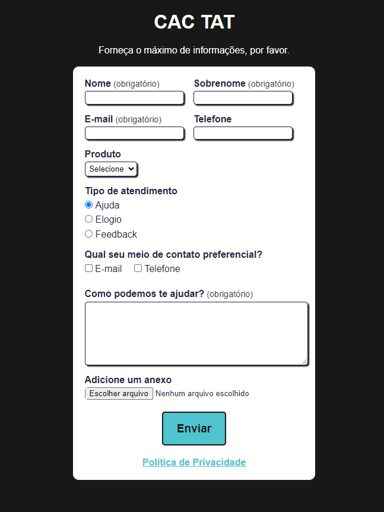
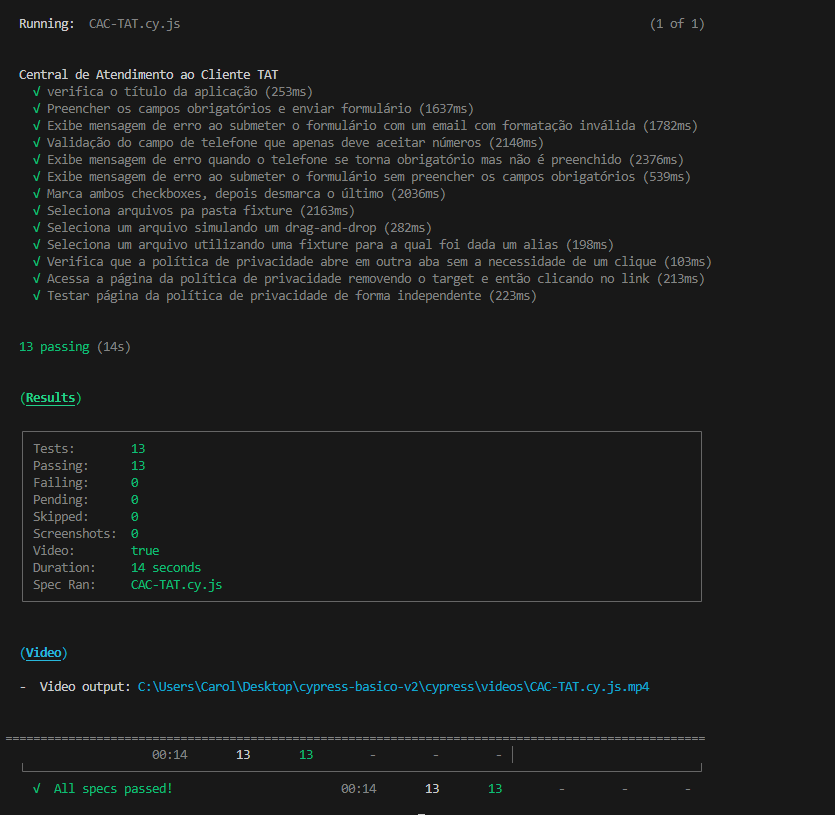

# Central de Atendimento ao Cliente TAT (CAC TAT)
A aplicação Central de Atendimento ao Cliente TAT (CAC TAT) é um formulário que simula o envio de mensagens à uma central de atendimento ao cliente. Neste README, você encontrará informações sobre como configurar o projeto, executar os testes e detalhes sobre as funcionalidades da aplicação.



# Configuração do Projeto
1. Pré-requisitos:
- Certifique-se de ter o Node.js instalado no seu sistema.
- Esse projeto foi realizado no Visual Studio Code (VS Code)
2. Clonando o Repositório:
- Clone este repositório para o seu ambiente local.
3. Instalação das Dependências:
- Abra o terminal na pasta do projeto e execute o comando:
  ```
  npm install
  ```

4. Executando os Testes:
Para rodar os testes, utilize o seguinte comando:
    ```
    npx cypress run
    ```
## Preview


[CAC-TAT - Vídeo](cypress/assets/CAC-TAT.cy.js.mp4)


# Funcionalidades da Aplicação
### Campos Obrigatórios:<br>
**Nome:** Campo de texto para inserir o nome.<br>
**Sobrenome:** Campo de texto para inserir o sobrenome.<br>
**Email:** Campo de email com validação.<br>
**Como podemos te ajudar?:** Área de texto para detalhar a mensagem.<br>
### Outros Campos:
**Telefone:** Campo opcional para inserir o número de telefone.<br>
**Produto:** Seleção suspensa com opções (Blog, Cursos, Mentoria, YouTube).<br>
**Tipo de Atendimento:** Opções de rádio (Ajuda, Elogio, Feedback).<br>
**Meio de Contato Preferencial:** Checkbox com opções (Email, Telefone).<br>
**Anexo:** Possibilidade de adicionar um arquivo como anexo ao atendimento.<br>
### Regras dos Meios de Contato Preferenciais:
- Quando o checkbox “Telefone” é marcado, o input do número do telefone passa a ser obrigatório.
- Ao desmarcar o checkbox “Telefone”, o input do número do telefone deixa de ser obrigatório.
### Política de Privacidade:
- Ao clicar no link “Política de privacidade”, na parte inferior da página, tal página é aberta em uma nova aba do navegador.
### Contribuição
Contribuições são bem-vindas! Sinta-se à vontade para abrir issues ou enviar pull requests.
### Créditos
Este projeto de testes automatizados com Cypress foi realizado como parte do curso Testes Automatizados com Cypress - Básico, oferecido pela Escola **Talking About Testing** e ministrado por Walmyr Filho. Agradeço ao instrutor e à escola por fornecerem conhecimento valioso sobre testes automatizados. 🌟
